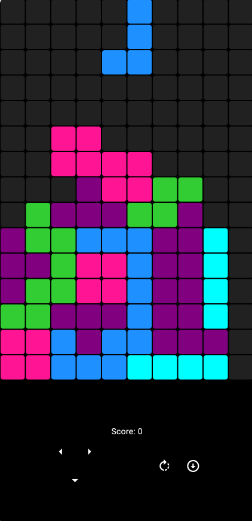

# Tetris Game

A classic Tetris game built with Flutter. This project is a clone inspired by [Mitch Koko](https://www.youtube.com/@createdbykoko), with additional features implemented by myself.

## Screenshots
<!-- Add screenshots of your app here if available -->



## Features

- Classic Tetris gameplay.
- Responsive and intuitive controls.
- Score tracking progression.
- Soft Drop added
- Optimization for multiple lines
- Score multiplier for multiple lines
- Hard Drop added
- 🚀 Upcoming Features (WIP) added by myself:
  - Hold Mechanic: Save a Tetromino for later.
  - Background Customization: Add a custom background.
  - Touch Controls: Swipe gestures instead of buttons.
  - Game Menu: Implement a main menu UI.

## 🚀 Getting Started

### Prerequisites

- Flutter SDK installed on your machine. If not, follow the [official Flutter installation guide](https://flutter.dev/docs/get-started/install).
- An IDE or text editor (e.g., Android Studio, VS Code).

### Installation

1. Clone the repository:

   ```bash
   git clone https://github.com/your-username/tetris-app.git

2. Navigate to the project directory:

   ```bash
    cd tetris-app

3. Install dependencies:

   ```bash
    flutter pub get

4. Run the app:

   ```bash
   flutter run

## 🎮 How to Play

Use the on-screen buttons to move the Tetrominoes.

Rotate the pieces using the rotate button.

Clear lines to score points.

## 📌 Acknowledgments

This project is a clone inspired by Mitch Koko with features added by myself.

## 📜 License

This project is licensed under the MIT License. See the LICENSE file for details.

## 📬 Contact

If you have any questions or feedback, feel free to reach out:

Email: [jmsalazar.macg@hotmail.com](mailto:jmsalazar@hotmail.com)

GitHub: [Sleusnarmed](https://github.com/Sleusnarmed)
